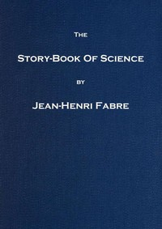

# The Story-book of Science <kbd>v2.2.1</kbd>

## Authors

 - Fabre, Jean-Henri <small>(1823 - 1915)</small>

## Translators

 - Bicknell, Florence Constable <small>(-1 - -1)</small>

## Subjects

 - Science

## Readablility

 - **A1:** 72%
 - **A2:** 78%
 - **B1:** 85%
 - **B2:** 91%
 - **C1:** 96%
 - **C2:** 100%

## Words Count

 - **A1:** 484
 - **A2:** 468
 - **B1:** 831
 - **B2:** 1269
 - **C1:** 1530
 - **C2:** 1108

## Source

<kbd>GUTHENBURGE:56795</kbd>
