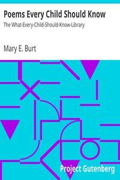

# Poems Every Child Should Know: The What-Every-Child-Should-Know-Library <kbd>v2.2.1</kbd>

## Authors

## Translators

## Subjects

 - American poetry
 - English poetry

## Readablility

 - **A1:** 72%
 - **A2:** 79%
 - **B1:** 85%
 - **B2:** 92%
 - **C1:** 97%
 - **C2:** 100%

## Words Count

 - **A1:** 490
 - **A2:** 450
 - **B1:** 792
 - **B2:** 1201
 - **C1:** 1503
 - **C2:** 1093

## Source

<kbd>GUTHENBURGE:16436</kbd>
