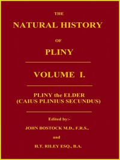

# The Natural History of Pliny, Volume 1 (of 6) <kbd>v2.2.1</kbd>

## Authors

 - Pliny, the Elder <small>(23 - 79)</small>

## Translators

 - Riley, Henry T. (Henry Thomas) <small>(1816 - 1878)</small>
 - Bostock, John <small>(1773 - 1846)</small>

## Subjects

 - Natural history

## Readablility

 - **A1:** 79%
 - **A2:** 85%
 - **B1:** 90%
 - **B2:** 95%
 - **C1:** 98%
 - **C2:** 100%

## Words Count

 - **A1:** 484
 - **A2:** 441
 - **B1:** 805
 - **B2:** 1344
 - **C1:** 1617
 - **C2:** 1287

## Source

<kbd>GUTHENBURGE:57493</kbd>
