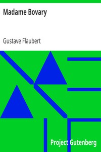

# Madame Bovary <kbd>v2.3.0</kbd>

## Authors

 - Flaubert, Gustave <small>(1821 - 1880)</small>

## Translators

 - Aveling, Eleanor Marx <small>(1855 - 1898)</small>

## Subjects

 - Adultery
 - Domestic fiction
 - France
 - Married women
 - Middle class
 - Physicians' spouses
 - Suicide victims

## Readablility

 - **A1:** 76%
 - **A2:** 82%
 - **B1:** 87%
 - **B2:** 93%
 - **C1:** 98%
 - **C2:** 100%

## Words Count

 - **A1:** 489
 - **A2:** 491
 - **B1:** 887
 - **B2:** 1520
 - **C1:** 1936
 - **C2:** 1511

## Source

<kbd>GUTHENBURGE:2413</kbd>
