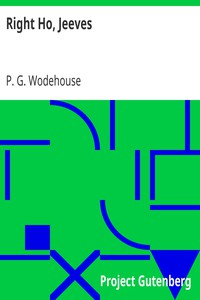

# Right Ho, Jeeves <kbd>v2.3.0</kbd>

## Authors

 - Wodehouse, P. G. (Pelham Grenville) <small>(1881 - 1975)</small>

## Translators

## Subjects

 - England
 - Humorous stories
 - Jeeves (Fictitious character)
 - Single men
 - Valets
 - Wooster, Bertie (Fictitious character)

## Readablility

 - **A1:** 77%
 - **A2:** 83%
 - **B1:** 88%
 - **B2:** 93%
 - **C1:** 98%
 - **C2:** 100%

## Words Count

 - **A1:** 487
 - **A2:** 466
 - **B1:** 795
 - **B2:** 1190
 - **C1:** 1356
 - **C2:** 1010

## Source

<kbd>GUTHENBURGE:10554</kbd>
