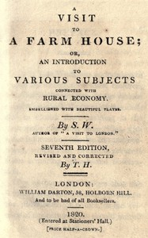

# A visit to a farm house; or, An introduction to various subjects connected with rural economy.: Seventh edition, revised and corrected. <kbd>v2.3.0</kbd>

## Authors

 - S. W., active 1801-1820? <small>(-1 - -1)</small>

## Translators

## Subjects

 - Animals
 - Brothers
 - Children
 - Conduct of life
 - Country life
 - Farm life
 - Intergenerational relations

## Readablility

 - **A1:** 76%
 - **A2:** 82%
 - **B1:** 88%
 - **B2:** 94%
 - **C1:** 98%
 - **C2:** 100%

## Words Count

 - **A1:** 465
 - **A2:** 361
 - **B1:** 539
 - **B2:** 652
 - **C1:** 517
 - **C2:** 253

## Source

<kbd>GUTHENBURGE:68171</kbd>
