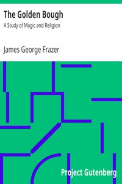

# The Golden Bough: A Study of Magic and Religion <kbd>v2.2.1</kbd>

## Authors

 - Frazer, James George <small>(1854 - 1941)</small>

## Translators

## Subjects

 - Magic
 - Mythology
 - Religion
 - Superstition

## Readablility

 - **A1:** 73%
 - **A2:** 79%
 - **B1:** 85%
 - **B2:** 91%
 - **C1:** 97%
 - **C2:** 100%

## Words Count

 - **A1:** 494
 - **A2:** 495
 - **B1:** 976
 - **B2:** 1826
 - **C1:** 3058
 - **C2:** 3112

## Source

<kbd>GUTHENBURGE:3623</kbd>
