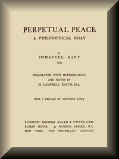

# Perpetual Peace: A Philosophical Essay <kbd>v2.3.0</kbd>

## Authors

 - Kant, Immanuel <small>(1724 - 1804)</small>

## Translators

 - Smith, Mary Campbell <small>(-1 - -1)</small>

## Subjects

 - Peace

## Readablility

 - **A1:** 73%
 - **A2:** 80%
 - **B1:** 86%
 - **B2:** 93%
 - **C1:** 98%
 - **C2:** 100%

## Words Count

 - **A1:** 471
 - **A2:** 401
 - **B1:** 661
 - **B2:** 1006
 - **C1:** 1083
 - **C2:** 668

## Source

<kbd>GUTHENBURGE:50922</kbd>
