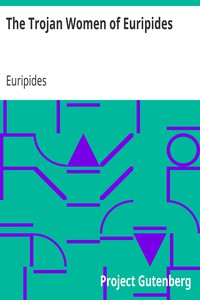

# The Trojan Women of Euripides <kbd>v2.2.1</kbd>

## Authors

 - Euripides <small>(-1 - -406)</small>

## Translators

 - Murray, Gilbert <small>(1866 - 1957)</small>

## Subjects

 - Andromache (Legendary character)
 - Cassandra (Legendary character)
 - Hecuba, Queen of Troy
 - Helen, of Troy, Queen of Sparta
 - Trojan War

## Readablility

 - **A1:** 74%
 - **A2:** 81%
 - **B1:** 87%
 - **B2:** 93%
 - **C1:** 98%
 - **C2:** 100%

## Words Count

 - **A1:** 452
 - **A2:** 337
 - **B1:** 493
 - **B2:** 623
 - **C1:** 571
 - **C2:** 230

## Source

<kbd>GUTHENBURGE:35171</kbd>
