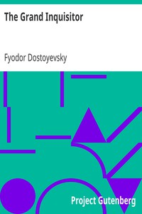

# The Grand Inquisitor <kbd>v2.0.2</kbd>

## Authors

 - Dostoyevsky, Fyodor <small>(1821 - 1881)</small>

## Translators

 - Blavatsky, H. P. (Helena Petrovna) <small>(1831 - 1891)</small>

## Subjects

 - Christian fiction
 - Jesus Christ

## Readablility

 - **A1:** 47%
 - **A2:** 54%
 - **B1:** 67%
 - **B2:** 82%
 - **C1:** 87%
 - **C2:** 100%

## Words Count

 - **A1:** 392
 - **A2:** 267
 - **B1:** 380
 - **B2:** 490
 - **C1:** 203
 - **C2:** 833

## Source

<kbd>GUTHENBURGE:8578</kbd>
