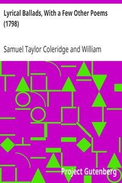

# Lyrical Ballads, With a Few Other Poems (1798) <kbd>v2.3.0</kbd>

## Authors

 - Coleridge, Samuel Taylor <small>(1772 - 1834)</small>
 - Wordsworth, William <small>(1770 - 1850)</small>

## Translators

## Subjects

 - English poetry

## Readablility

 - **A1:** 73%
 - **A2:** 80%
 - **B1:** 86%
 - **B2:** 93%
 - **C1:** 97%
 - **C2:** 100%

## Words Count

 - **A1:** 470
 - **A2:** 356
 - **B1:** 532
 - **B2:** 736
 - **C1:** 694
 - **C2:** 400

## Source

<kbd>GUTHENBURGE:9622</kbd>
