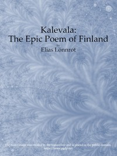

# Kalevala : the Epic Poem of Finland — Complete <kbd>v2.3.0</kbd>

## Authors

## Translators

 - Crawford, John Martin <small>(1845 - 1916)</small>

## Subjects

 - Finnish poetry

## Readablility

 - **A1:** 67%
 - **A2:** 73%
 - **B1:** 81%
 - **B2:** 89%
 - **C1:** 96%
 - **C2:** 100%

## Words Count

 - **A1:** 483
 - **A2:** 442
 - **B1:** 814
 - **B2:** 1229
 - **C1:** 1555
 - **C2:** 1241

## Source

<kbd>GUTHENBURGE:5186</kbd>
