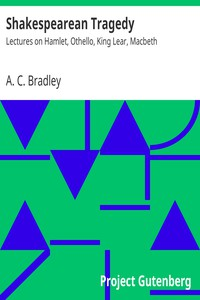

# Shakespearean Tragedy: Lectures on Hamlet, Othello, King Lear, Macbeth <kbd>v2.2.1</kbd>

## Authors

 - Bradley, A. C. (Andrew Cecil) <small>(1851 - 1935)</small>

## Translators

## Subjects

 - Shakespeare, William, 1564-1616

## Readablility

 - **A1:** 76%
 - **A2:** 82%
 - **B1:** 88%
 - **B2:** 94%
 - **C1:** 98%
 - **C2:** 100%

## Words Count

 - **A1:** 492
 - **A2:** 485
 - **B1:** 887
 - **B2:** 1505
 - **C1:** 1999
 - **C2:** 1510

## Source

<kbd>GUTHENBURGE:16966</kbd>
