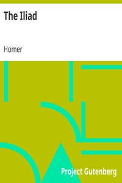

# The Iliad <kbd>v2.0.2</kbd>

## Authors

 - Homer <small>(-750 - -650)</small>

## Translators

 - Butler, Samuel <small>(1835 - 1902)</small>

## Subjects

 - Achilles (Mythological character)
 - Classical literature
 - Epic poetry, Greek
 - Trojan War

## Readablility

 - **A1:** 54%
 - **A2:** 59%
 - **B1:** 69%
 - **B2:** 82%
 - **C1:** 85%
 - **C2:** 100%

## Words Count

 - **A1:** 522
 - **A2:** 422
 - **B1:** 748
 - **B2:** 1140
 - **C1:** 537
 - **C2:** 4534

## Source

<kbd>GUTHENBURGE:2199</kbd>
