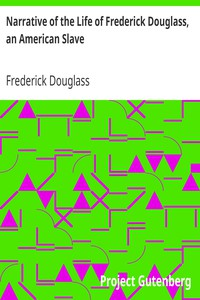

# Narrative of the Life of Frederick Douglass, an American Slave <kbd>GUTHENBURGE</kbd>

## Authors

 - Douglass, Frederick <small>(1818 - 1895)</small>

## Translators

## Subjects

 - Abolitionists
 - African American abolitionists
 - Douglass, Frederick, 1818-1895
 - Slaves

## Readablility

 - **A1:** 54%
 - **A2:** 61%
 - **B1:** 71%
 - **B2:** 85%
 - **C1:** 89%
 - **C2:** 100%

## Words Count

 - **A1:** 530
 - **A2:** 459
 - **B1:** 749
 - **B2:** 1065
 - **C1:** 431
 - **C2:** 2210

## Tagger Version

v2.0.0
