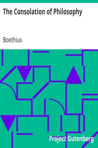

# The Consolation of Philosophy <kbd>v2.0.2</kbd>

## Authors

 - Boethius <small>(480 - 524)</small>

## Translators

 - James, H. R. (Henry Rosher) <small>(1862 - 1931)</small>

## Subjects

 - Happiness
 - Philosophy and religion

## Readablility

 - **A1:** 45%
 - **A2:** 52%
 - **B1:** 63%
 - **B2:** 78%
 - **C1:** 83%
 - **C2:** 100%

## Words Count

 - **A1:** 510
 - **A2:** 420
 - **B1:** 697
 - **B2:** 1076
 - **C1:** 408
 - **C2:** 3136

## Source

<kbd>GUTHENBURGE:14328</kbd>
