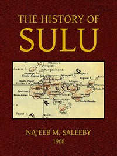

# The History of Sulu <kbd>v2.2.1</kbd>

## Authors

 - Saleeby, Najeeb M. (Najeeb Mitry) <small>(1870 - -1)</small>

## Translators

## Subjects

 - Mindanao Island (Philippines)
 - Muslims
 - Sulu Archipelago (Philippines)

## Readablility

 - **A1:** 73%
 - **A2:** 79%
 - **B1:** 86%
 - **B2:** 93%
 - **C1:** 97%
 - **C2:** 100%

## Words Count

 - **A1:** 484
 - **A2:** 461
 - **B1:** 841
 - **B2:** 1319
 - **C1:** 1678
 - **C2:** 997

## Source

<kbd>GUTHENBURGE:41771</kbd>
