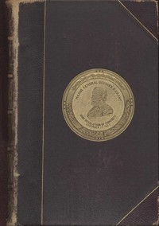

# Personal Memoirs of U. S. Grant, Complete <kbd>v2.3.0</kbd>

## Authors

 - Grant, Ulysses S. (Ulysses Simpson) <small>(1822 - 1885)</small>

## Translators

## Subjects

 - Generals
 - Grant, Ulysses S. (Ulysses Simpson), 1822-1885
 - Mexican War, 1846-1848
 - Presidents
 - United States
 - United States. Army

## Readablility

 - **A1:** 75%
 - **A2:** 83%
 - **B1:** 89%
 - **B2:** 95%
 - **C1:** 98%
 - **C2:** 100%

## Words Count

 - **A1:** 488
 - **A2:** 476
 - **B1:** 888
 - **B2:** 1463
 - **C1:** 1895
 - **C2:** 1264

## Source

<kbd>GUTHENBURGE:4367</kbd>
