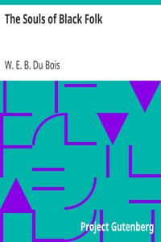

# The Souls of Black Folk <kbd>v2.2.0</kbd>

## Authors

 - Du Bois, W. E. B. (William Edward Burghardt) <small>(1868 - 1963)</small>

## Translators

## Subjects

 - African Americans

## Readablility

 - **A1:** 71%
 - **A2:** 78%
 - **B1:** 85%
 - **B2:** 92%
 - **C1:** 97%
 - **C2:** 100%

## Words Count

 - **A1:** 3142
 - **A2:** 480
 - **B1:** 882
 - **B2:** 1348
 - **C1:** 1639
 - **C2:** 1136

## Source

<kbd>GUTHENBURGE:408</kbd>
