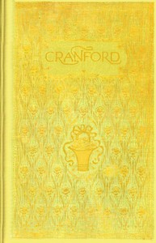

# Cranford <kbd>v2.2.1</kbd>

## Authors

 - Gaskell, Elizabeth Cleghorn <small>(1810 - 1865)</small>

## Translators

## Subjects

 - England
 - Female friendship
 - Older women
 - Pastoral fiction
 - Sisters
 - Villages

## Readablility

 - **A1:** 79%
 - **A2:** 85%
 - **B1:** 90%
 - **B2:** 95%
 - **C1:** 98%
 - **C2:** 100%

## Words Count

 - **A1:** 491
 - **A2:** 471
 - **B1:** 838
 - **B2:** 1215
 - **C1:** 1306
 - **C2:** 736

## Source

<kbd>GUTHENBURGE:394</kbd>
