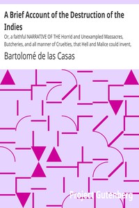

# A Brief Account of the Destruction of the Indies: Or, a faithful NARRATIVE OF THE Horrid and Unexampled Massacres, Butcheries, and all manner of Cruelties, that Hell and Malice could invent, committed by the Popish Spanish Party on the inhabitants of West-India, TOGETHER With the Devastations of several Kingdoms in America by Fire and Sword, for the space of Forty and Two Years, from the time of its first Discovery by them. <kbd>v2.2.1</kbd>

## Authors

 - Casas, Bartolomé de las <small>(1484 - 1566)</small>

## Translators

## Subjects

 - Indians, Treatment of
 - Spain

## Readablility

 - **A1:** 76%
 - **A2:** 80%
 - **B1:** 87%
 - **B2:** 93%
 - **C1:** 98%
 - **C2:** 100%

## Words Count

 - **A1:** 449
 - **A2:** 343
 - **B1:** 600
 - **B2:** 759
 - **C1:** 753
 - **C2:** 458

## Source

<kbd>GUTHENBURGE:20321</kbd>
