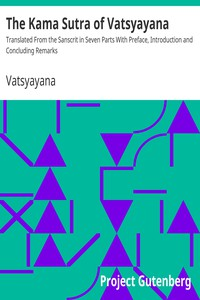

# The Kama Sutra of Vatsyayana: Translated From the Sanscrit in Seven Parts With Preface, Introduction and Concluding Remarks <kbd>GUTHENBURGE</kbd>

## Authors

 - Vatsyayana <small>(-1 - -1)</small>

## Translators

 - Indrajit, Bhagavanlal <small>(-1 - -1)</small>
 - Bhide, Shivaram Parashuram <small>(-1 - -1)</small>
 - Burton, Richard Francis, Sir <small>(1821 - 1890)</small>

## Subjects

 - Love
 - Sex

## Readablility

 - **A1:** 46%
 - **A2:** 60%
 - **B1:** 75%
 - **B2:** 87%
 - **C1:** 96%
 - **C2:** 100%

## Words Count

 - **A1:** 389
 - **A2:** 395
 - **B1:** 692
 - **B2:** 882
 - **C1:** 910
 - **C2:** 536
