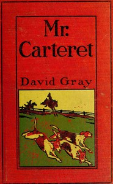

# Mr. Carteret and Others <kbd>v2.3.0</kbd>

## Authors

 - Gray, David <small>(1870 - 1968)</small>

## Translators

## Subjects

 - Americans
 - England
 - Fox hunting

## Readablility

 - **A1:** 78%
 - **A2:** 84%
 - **B1:** 90%
 - **B2:** 95%
 - **C1:** 98%
 - **C2:** 100%

## Words Count

 - **A1:** 480
 - **A2:** 410
 - **B1:** 594
 - **B2:** 750
 - **C1:** 708
 - **C2:** 357

## Source

<kbd>GUTHENBURGE:68051</kbd>
