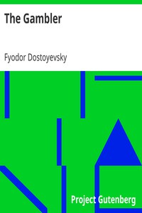

# The Gambler <kbd>v2.2.1</kbd>

## Authors

 - Dostoyevsky, Fyodor <small>(1821 - 1881)</small>

## Translators

 - Hogarth, C. J. <small>(1869 - 1942)</small>

## Subjects

 - Chance
 - Families
 - Gamblers
 - Gambling
 - Psychological fiction
 - Russians

## Readablility

 - **A1:** 79%
 - **A2:** 84%
 - **B1:** 90%
 - **B2:** 94%
 - **C1:** 98%
 - **C2:** 100%

## Words Count

 - **A1:** 483
 - **A2:** 435
 - **B1:** 772
 - **B2:** 1068
 - **C1:** 1091
 - **C2:** 613

## Source

<kbd>GUTHENBURGE:2197</kbd>
