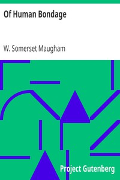

# Of Human Bondage <kbd>v2.3.0</kbd>

## Authors

 - Maugham, W. Somerset (William Somerset) <small>(1874 - 1965)</small>

## Translators

## Subjects

 - Artists
 - Bildungsromans
 - Orphans
 - People with disabilities
 - Physicians

## Readablility

 - **A1:** 79%
 - **A2:** 85%
 - **B1:** 90%
 - **B2:** 95%
 - **C1:** 98%
 - **C2:** 100%

## Words Count

 - **A1:** 495
 - **A2:** 491
 - **B1:** 950
 - **B2:** 1670
 - **C1:** 2348
 - **C2:** 1905

## Source

<kbd>GUTHENBURGE:351</kbd>
