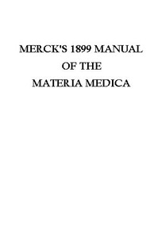

# Merck's 1899 Manual of the Materia Medica <kbd>v2.2.1</kbd>

## Authors

 - Merck & Co. <small>(-1 - -1)</small>

## Translators

## Subjects

 - Drugs
 - Materia medica
 - Pharmacology
 - Therapeutics

## Readablility

 - **A1:** 64%
 - **A2:** 68%
 - **B1:** 72%
 - **B2:** 79%
 - **C1:** 85%
 - **C2:** 97%

## Words Count

 - **A1:** 370
 - **A2:** 275
 - **B1:** 412
 - **B2:** 578
 - **C1:** 577
 - **C2:** 708

## Source

<kbd>GUTHENBURGE:41697</kbd>
