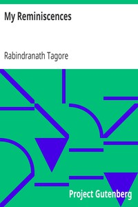

# My Reminiscences <kbd>v2.2.1</kbd>

## Authors

 - Tagore, Rabindranath <small>(1861 - 1941)</small>

## Translators

## Subjects

 - Authors, Bengali
 - Tagore, Rabindranath, 1861-1941

## Readablility

 - **A1:** 75%
 - **A2:** 81%
 - **B1:** 87%
 - **B2:** 93%
 - **C1:** 97%
 - **C2:** 100%

## Words Count

 - **A1:** 488
 - **A2:** 468
 - **B1:** 844
 - **B2:** 1298
 - **C1:** 1514
 - **C2:** 1078

## Source

<kbd>GUTHENBURGE:22217</kbd>
