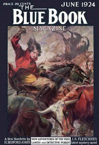

# The Hunter's Lodge Case <kbd>v2.3.0</kbd>

## Authors

 - Christie, Agatha <small>(1890 - 1976)</small>

## Translators

## Subjects

 - Detective and mystery stories
 - Murder
 - Poirot, Hercule (Fictitious character)
 - Private investigators
 - Short stories

## Readablility

 - **A1:** 73%
 - **A2:** 80%
 - **B1:** 87%
 - **B2:** 94%
 - **C1:** 99%
 - **C2:** 100%

## Words Count

 - **A1:** 392
 - **A2:** 199
 - **B1:** 274
 - **B2:** 281
 - **C1:** 185
 - **C2:** 65

## Source

<kbd>GUTHENBURGE:67160</kbd>
