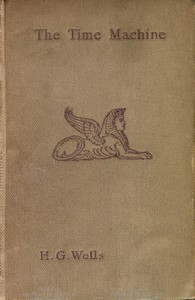

# The Time Machine <kbd>GUTHENBURGE</kbd>

## Authors

 - Wells, H. G. (Herbert George) <small>(1866 - 1946)</small>

## Translators

## Subjects

 - Dystopias
 - Science fiction
 - Time travel

## Readablility

 - **A1:** 46%
 - **A2:** 59%
 - **B1:** 72%
 - **B2:** 85%
 - **C1:** 95%
 - **C2:** 100%

## Words Count

 - **A1:** 381
 - **A2:** 394
 - **B1:** 623
 - **B2:** 911
 - **C1:** 872
 - **C2:** 576
