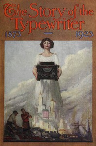

# The Story of the Typewriter, 1873-1923 <kbd>v2.2.1</kbd>

## Authors

 - Herkimer County Historical Society <small>(-1 - -1)</small>

## Translators

## Subjects

 - Typewriters

## Readablility

 - **A1:** 72%
 - **A2:** 78%
 - **B1:** 86%
 - **B2:** 92%
 - **C1:** 97%
 - **C2:** 100%

## Words Count

 - **A1:** 462
 - **A2:** 354
 - **B1:** 566
 - **B2:** 693
 - **C1:** 665
 - **C2:** 374

## Source

<kbd>GUTHENBURGE:60794</kbd>
