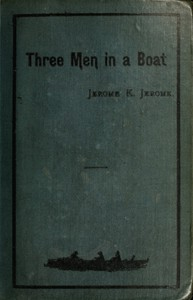

# Three Men in a Boat (To Say Nothing of the Dog) <kbd>GUTHENBURGE</kbd>

## Authors

 - Jerome, Jerome K. (Jerome Klapka) <small>(1859 - 1927)</small>

## Translators

## Subjects

 - Boats and boating
 - Dogs
 - Humorous stories, English
 - Male friendship
 - Thames River (England)
 - Young men

## Readablility

 - **A1:** 51%
 - **A2:** 65%
 - **B1:** 77%
 - **B2:** 87%
 - **C1:** 96%
 - **C2:** 100%

## Words Count

 - **A1:** 401
 - **A2:** 463
 - **B1:** 790
 - **B2:** 1160
 - **C1:** 1274
 - **C2:** 857
