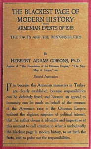

# The blackest page in modern history: Events in Armenia in 1915: the facts and the responsibilities <kbd>v2.2.1</kbd>

## Authors

 - Gibbons, Herbert Adams <small>(1880 - 1934)</small>

## Translators

## Subjects

 - Armenian Genocide, 1915-1923
 - Armenian question

## Readablility

 - **A1:** 72%
 - **A2:** 79%
 - **B1:** 85%
 - **B2:** 92%
 - **C1:** 98%
 - **C2:** 100%

## Words Count

 - **A1:** 398
 - **A2:** 252
 - **B1:** 327
 - **B2:** 393
 - **C1:** 325
 - **C2:** 134

## Source

<kbd>GUTHENBURGE:68082</kbd>
