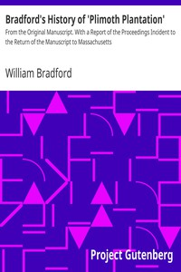

# Bradford's History of 'Plimoth Plantation': From the Original Manuscript. With a Report of the Proceedings Incident to the Return of the Manuscript to Massachusetts <kbd>v2.0.2</kbd>

## Authors

 - Bradford, William <small>(1590 - 1657)</small>

## Translators

## Subjects

 - Massachusetts

## Readablility

 - **A1:** 45%
 - **A2:** 49%
 - **B1:** 58%
 - **B2:** 69%
 - **C1:** 72%
 - **C2:** 100%

## Words Count

 - **A1:** 579
 - **A2:** 497
 - **B1:** 849
 - **B2:** 1295
 - **C1:** 521
 - **C2:** 8379

## Source

<kbd>GUTHENBURGE:24950</kbd>
