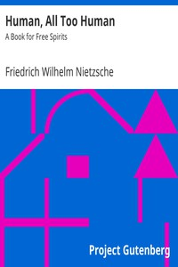

# Human, All Too Human: A Book for Free Spirits <kbd>v2.3.0</kbd>

## Authors

 - Nietzsche, Friedrich Wilhelm <small>(1844 - 1900)</small>

## Translators

 - Harvey, Alexander <small>(1868 - 1949)</small>

## Subjects

 - Human beings

## Readablility

 - **A1:** 72%
 - **A2:** 78%
 - **B1:** 85%
 - **B2:** 92%
 - **C1:** 97%
 - **C2:** 100%

## Words Count

 - **A1:** 457
 - **A2:** 371
 - **B1:** 639
 - **B2:** 909
 - **C1:** 1026
 - **C2:** 633

## Source

<kbd>GUTHENBURGE:38145</kbd>
