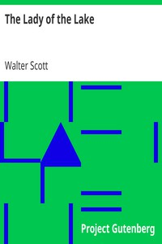

# The Lady of the Lake <kbd>v2.3.0</kbd>

## Authors

 - Scott, Walter <small>(1771 - 1832)</small>

## Translators

## Subjects

 - Arthurian romances
 - Lady of the Lake (Legendary character)

## Readablility

 - **A1:** 71%
 - **A2:** 76%
 - **B1:** 83%
 - **B2:** 90%
 - **C1:** 96%
 - **C2:** 100%

## Words Count

 - **A1:** 494
 - **A2:** 475
 - **B1:** 864
 - **B2:** 1416
 - **C1:** 1822
 - **C2:** 1307

## Source

<kbd>GUTHENBURGE:3011</kbd>
