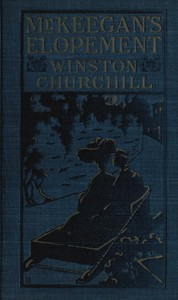

# Mr. Keegan's Elopement <kbd>v2.3.0</kbd>

## Authors

 - Churchill, Winston <small>(1871 - 1947)</small>

## Translators

## Subjects

 - Elopement
 - Madeira Islands
 - United States. Navy

## Readablility

 - **A1:** 75%
 - **A2:** 82%
 - **B1:** 88%
 - **B2:** 94%
 - **C1:** 98%
 - **C2:** 100%

## Words Count

 - **A1:** 445
 - **A2:** 306
 - **B1:** 402
 - **B2:** 474
 - **C1:** 365
 - **C2:** 180

## Source

<kbd>GUTHENBURGE:67957</kbd>
