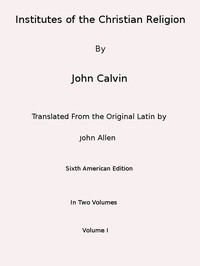

# Institutes of the Christian Religion (Vol. 1 of 2) <kbd>v2.2.1</kbd>

## Authors

 - Calvin, Jean <small>(1509 - 1564)</small>

## Translators

 - Allen, John <small>(1771 - 1839)</small>

## Subjects

 - Reformed Church
 - Theology, Doctrinal

## Readablility

 - **A1:** 76%
 - **A2:** 80%
 - **B1:** 86%
 - **B2:** 92%
 - **C1:** 97%
 - **C2:** 100%

## Words Count

 - **A1:** 485
 - **A2:** 453
 - **B1:** 829
 - **B2:** 1397
 - **C1:** 1989
 - **C2:** 1718

## Source

<kbd>GUTHENBURGE:45001</kbd>
