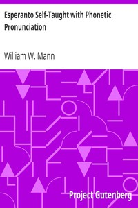

# Esperanto Self-Taught with Phonetic Pronunciation <kbd>v2.3.0</kbd>

## Authors

 - Mann, William W. <small>(-1 - -1)</small>

## Translators

## Subjects

 - Esperanto

## Readablility

 - **A1:** 80%
 - **A2:** 84%
 - **B1:** 87%
 - **B2:** 91%
 - **C1:** 95%
 - **C2:** 99%

## Words Count

 - **A1:** 459
 - **A2:** 353
 - **B1:** 536
 - **B2:** 703
 - **C1:** 785
 - **C2:** 683

## Source

<kbd>GUTHENBURGE:23984</kbd>
