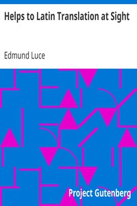

# Helps to Latin Translation at Sight <kbd>v2.0.2</kbd>

## Authors

 - Luce, Edmund <small>(-1 - -1)</small>

## Translators

## Subjects

 - Latin language

## Readablility

 - **A1:** 27%
 - **A2:** 32%
 - **B1:** 38%
 - **B2:** 48%
 - **C1:** 50%
 - **C2:** 100%

## Words Count

 - **A1:** 562
 - **A2:** 551
 - **B1:** 925
 - **B2:** 1471
 - **C1:** 590
 - **C2:** 18777

## Source

<kbd>GUTHENBURGE:28890</kbd>
