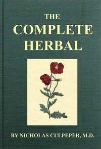

# The Complete Herbal: To which is now added, upwards of one hundred additional herbs, with a display of their medicinal and occult qualities physically applied to the cure of all disorders incident to mankind: to which are now first annexed, the English physician enlarged, and key to Physic. <kbd>v2.0.9</kbd>

## Authors

 - Culpeper, Nicholas <small>(1616 - 1654)</small>

## Translators

## Subjects

 - Botany, Medical
 - Botany, Medical
 - Herbs
 - Materia medica, Vegetable
 - Medicinal plants
 - Medicinal plants

## Readablility

 - **A1:** 60%
 - **A2:** 65%
 - **B1:** 72%
 - **B2:** 78%
 - **C1:** 80%
 - **C2:** 100%

## Words Count

 - **A1:** 752
 - **A2:** 526
 - **B1:** 765
 - **B2:** 1003
 - **C1:** 326
 - **C2:** 6653

## Source

<kbd>GUTHENBURGE:49513</kbd>
