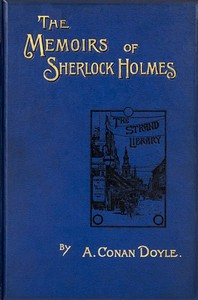

# The Memoirs of Sherlock Holmes <kbd>v2.2.1</kbd>

## Authors

 - Doyle, Arthur Conan <small>(1859 - 1930)</small>

## Translators

## Subjects

 - Detective and mystery stories, English
 - Holmes, Sherlock (Fictitious character)
 - Private investigators

## Readablility

 - **A1:** 79%
 - **A2:** 84%
 - **B1:** 90%
 - **B2:** 95%
 - **C1:** 98%
 - **C2:** 100%

## Words Count

 - **A1:** 490
 - **A2:** 483
 - **B1:** 873
 - **B2:** 1355
 - **C1:** 1549
 - **C2:** 971

## Source

<kbd>GUTHENBURGE:834</kbd>
