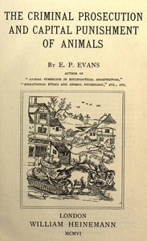

# The Criminal Prosecution and Capital Punishment of Animals <kbd>v2.2.1</kbd>

## Authors

 - Evans, E. P. (Edward Payson) <small>(1831 - 1917)</small>

## Translators

## Subjects

 - Animals
 - Animals, Prosecution and punishment of
 - Trials

## Readablility

 - **A1:** 73%
 - **A2:** 78%
 - **B1:** 83%
 - **B2:** 89%
 - **C1:** 95%
 - **C2:** 100%

## Words Count

 - **A1:** 483
 - **A2:** 439
 - **B1:** 805
 - **B2:** 1248
 - **C1:** 1639
 - **C2:** 1405

## Source

<kbd>GUTHENBURGE:43286</kbd>
