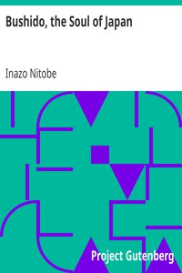

# Bushido, the Soul of Japan <kbd>v2.3.0</kbd>

## Authors

 - Nitobe, Inazo <small>(1862 - 1933)</small>

## Translators

## Subjects

 - Bushido
 - Ethics
 - Japan
 - Japan
 - Philosophy, Japanese
 - Samurai

## Readablility

 - **A1:** 71%
 - **A2:** 77%
 - **B1:** 84%
 - **B2:** 91%
 - **C1:** 97%
 - **C2:** 100%

## Words Count

 - **A1:** 483
 - **A2:** 440
 - **B1:** 748
 - **B2:** 1076
 - **C1:** 1192
 - **C2:** 832

## Source

<kbd>GUTHENBURGE:12096</kbd>
