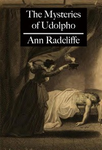

# The Mysteries of Udolpho <kbd>v2.2.1</kbd>

## Authors

 - Radcliffe, Ann Ward <small>(1764 - 1823)</small>

## Translators

## Subjects

 - Castles
 - Gothic fiction
 - Guardian and ward
 - Horror tales
 - Inheritance and succession
 - Italy
 - Orphans
 - Young women

## Readablility

 - **A1:** 75%
 - **A2:** 81%
 - **B1:** 87%
 - **B2:** 94%
 - **C1:** 98%
 - **C2:** 100%

## Words Count

 - **A1:** 494
 - **A2:** 487
 - **B1:** 930
 - **B2:** 1641
 - **C1:** 2196
 - **C2:** 1478

## Source

<kbd>GUTHENBURGE:3268</kbd>
