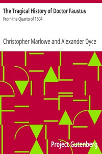

# The Tragical History of Doctor Faustus: From the Quarto of 1604 <kbd>GUTHENBURGE</kbd>

## Authors

 - Marlowe, Christopher <small>(1564 - 1593)</small>

## Translators

## Subjects

 - Faust, -approximately 1540
 - Germany
 - Magicians
 - Tragedies

## Readablility

 - **A1:** 44%
 - **A2:** 50%
 - **B1:** 60%
 - **B2:** 74%
 - **C1:** 77%
 - **C2:** 100%

## Words Count

 - **A1:** 424
 - **A2:** 302
 - **B1:** 467
 - **B2:** 621
 - **C1:** 225
 - **C2:** 2143

## Tagger Version

v2.0.0
