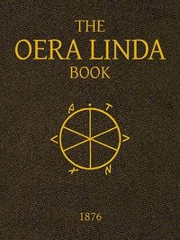

# The Oera Linda Book, from a Manuscript of the Thirteenth Century <kbd>v2.2.1</kbd>

## Authors

## Translators

 - Ottema, J. G. (Jan Gerhardus) <small>(1804 - 1879)</small>
 - Sandbach, William R. <small>(-1 - -1)</small>

## Subjects

 - Frisian language

## Readablility

 - **A1:** 82%
 - **A2:** 85%
 - **B1:** 89%
 - **B2:** 92%
 - **C1:** 95%
 - **C2:** 100%

## Words Count

 - **A1:** 487
 - **A2:** 439
 - **B1:** 737
 - **B2:** 992
 - **C1:** 920
 - **C2:** 496

## Source

<kbd>GUTHENBURGE:40986</kbd>
