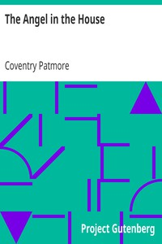

# The Angel in the House <kbd>v2.2.1</kbd>

## Authors

 - Patmore, Coventry <small>(1823 - 1896)</small>

## Translators

## Subjects

 - Husband and wife
 - Marriage
 - Women

## Readablility

 - **A1:** 72%
 - **A2:** 79%
 - **B1:** 86%
 - **B2:** 92%
 - **C1:** 97%
 - **C2:** 100%

## Words Count

 - **A1:** 461
 - **A2:** 376
 - **B1:** 574
 - **B2:** 787
 - **C1:** 828
 - **C2:** 526

## Source

<kbd>GUTHENBURGE:4099</kbd>
