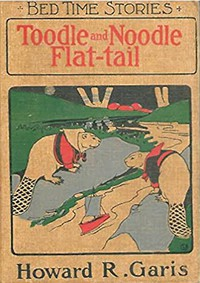

# Toodle and Noodle Flat-tail: The Jolly Beaver Boys <kbd>v2.3.0</kbd>

## Authors

 - Garis, Howard Roger <small>(1873 - 1962)</small>

## Translators

## Subjects

 - Animals
 - Beavers

## Readablility

 - **A1:** 77%
 - **A2:** 84%
 - **B1:** 88%
 - **B2:** 93%
 - **C1:** 97%
 - **C2:** 100%

## Words Count

 - **A1:** 448
 - **A2:** 299
 - **B1:** 437
 - **B2:** 480
 - **C1:** 451
 - **C2:** 257

## Source

<kbd>GUTHENBURGE:67990</kbd>
