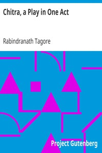

# Chitra, a Play in One Act <kbd>v2.2.1</kbd>

## Authors

 - Tagore, Rabindranath <small>(1861 - 1941)</small>

## Translators

## Subjects

 - Indic drama

## Readablility

 - **A1:** 72%
 - **A2:** 79%
 - **B1:** 87%
 - **B2:** 93%
 - **C1:** 98%
 - **C2:** 100%

## Words Count

 - **A1:** 400
 - **A2:** 246
 - **B1:** 340
 - **B2:** 391
 - **C1:** 291
 - **C2:** 142

## Source

<kbd>GUTHENBURGE:2502</kbd>
