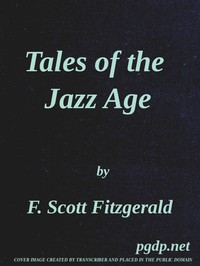

# Tales of the Jazz Age <kbd>v2.3.0</kbd>

## Authors

 - Fitzgerald, F. Scott (Francis Scott) <small>(1896 - 1940)</small>

## Translators

## Subjects

 - Short stories
 - United States

## Readablility

 - **A1:** 74%
 - **A2:** 80%
 - **B1:** 87%
 - **B2:** 92%
 - **C1:** 97%
 - **C2:** 100%

## Words Count

 - **A1:** 493
 - **A2:** 479
 - **B1:** 889
 - **B2:** 1426
 - **C1:** 1824
 - **C2:** 1474

## Source

<kbd>GUTHENBURGE:6695</kbd>
